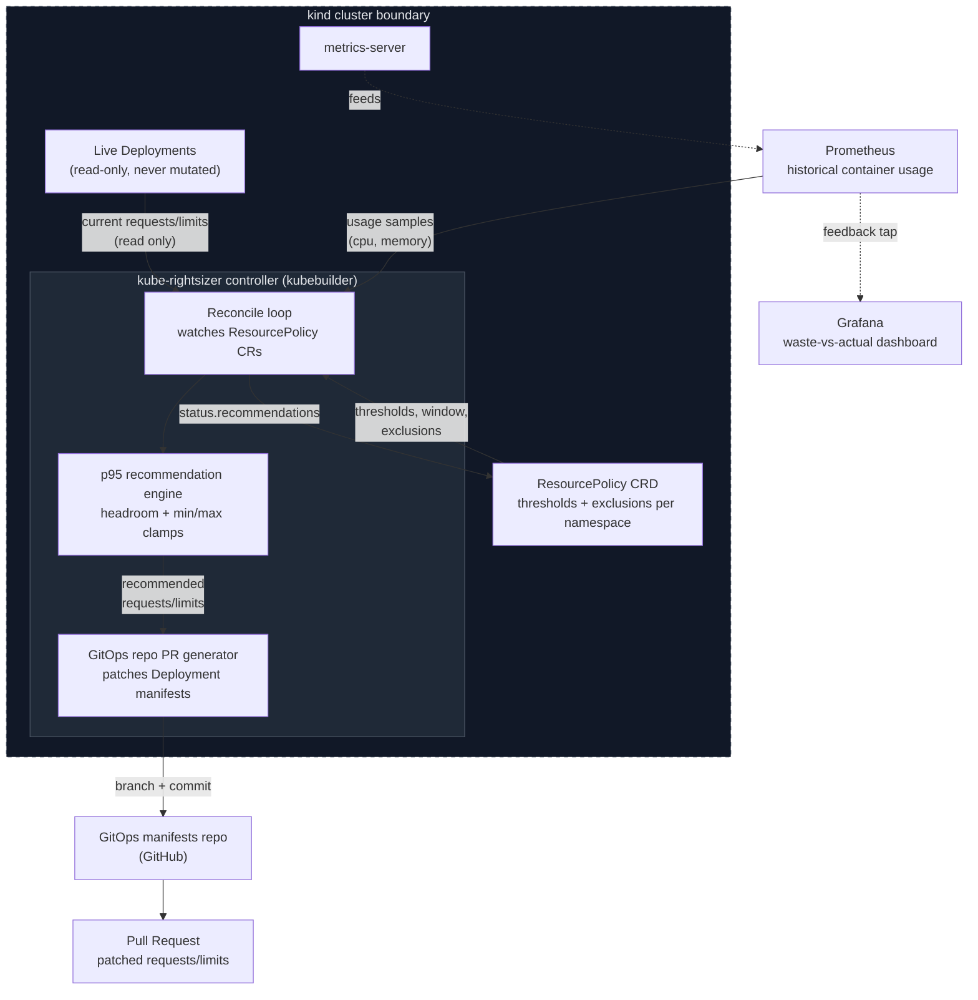

# kube-rightsizer

**Right-size Kubernetes workloads from real usage history - as a reviewable pull request, never a live mutation.**


[](https://github.com/yeshwanth-aleti/kube-rightsizer/actions/workflows/ci.yml)
[](https://go.dev)
[](LICENSE)

## The problem

Most teams set CPU/memory "requests" once, at deploy time, as a guess - and then never revisit them. The result, consistently observed across FinOps reports (CNCF, Kubecost, Datadog): **30-50% of provisioned compute in a typical cluster is never used.** Nobody right-sizes proactively because:

- **It's manual and easy to get wrong.** Turning a Grafana chart into a "kubectl edit" is toil nobody prioritizes.
- **It's risky.** Kubernetes' built-in answer, the Vertical Pod Autoscaler, can mutate live Pod specs and evict/restart workloads to apply new resources - a legitimate but scary blast radius for anyone who has been paged by a VPA-triggered restart storm.
- **There's no audit trail.** Even when someone does right-size manually, it rarely goes through code review.

**kube-rightsizer** takes a different, deliberately boring stance: it never touches a live object. It watches real Prometheus usage history, computes a statistically sound (p95 + safety headroom) recommendation per container, and opens a **GitHub pull request** against your GitOps manifests repo. A human (or your existing auto-merge policy) reviews and merges it like any other change - your normal rollout, canary, and rollback machinery keeps working exactly as it does today.

## Architecture



**Why a PR, not a Pod patch?** This is the one architectural choice that matters most. The Vertical Pod Autoscaler is powerful, but "an automated system directly mutates my running Deployment's resources" is a decision most platform teams are (rightly) nervous about in production. Routing every recommendation through the exact same review + CI + progressive-rollout pipeline that any other manifest change goes through means kube-rightsizer inherits your existing safety net for free, instead of needing to reinvent canarying, rollback, and approval gates.

## How it works

1. **ResourcePolicy CRD** - a namespaced custom resource that configures, per namespace: the historical look-back window ("7d", "24h", ...), the percentile and safety headroom for CPU and memory independently, hard min/max clamps, workload/container exclusions, and the GitOps repo + branch + manifest path a PR should target.
2. **Reconcile loop** - on each tick, the controller lists the Deployments a policy selects, and for every container queries Prometheus for "rate(container_cpu_usage_seconds_total[5m])" and "container_memory_working_set_bytes" over the configured window.
3. **Recommendation engine** (internal/recommend) - computes the p-th percentile (default p95) of the usage samples, adds the configured headroom (default 15%), clamps to any configured floor/ceiling, and derives a limit via a configurable request->limit multiplier. Pure function of "[]float64 -> Recommendation", independent of Kubernetes or Prometheus types, so its math is exhaustively unit tested in isolation.
4. **Change threshold** - a recommendation is only acted on if it differs from the container's current request by more than "changeThresholdPercent" (default 10%), so a stable workload doesn't generate PR noise every reconcile.
5. **GitOps PR generator** (internal/gitops + internal/patch) - clones the GitOps manifests repo, checks out a new branch, surgically patches only the "resources.requests"/"resources.limits" of the affected containers in the target Deployment's YAML (via a "yaml.Node" tree edit, so comments/formatting/unrelated fields are untouched), commits, pushes, and opens a pull request with a table summarizing the change. **No live cluster object is ever modified.**
6. **Status + feedback loop** - every computed recommendation (whether or not it crossed the PR threshold) is written to "ResourcePolicy.status.recommendations", and the included Grafana dashboard ("dashboards/waste-vs-actual.json") plots requested vs. p95-actual usage and an estimated waste percentage, sourced from the same Prometheus metrics-server feeds.

## Quick start

### Prerequisites
- Go 1.23+
- kind + kubectl (for the local demo; no cloud account needed)
- A GitHub personal access token with "repo" scope (only needed to actually open PRs against a real GitOps repo - the demo below runs in dry-run mode without one)

### Run the tests (fully offline - no cluster, no Docker daemon, no network)

```bash
go build ./...
go test ./...
```

All recommendation math, YAML patching, and GitOps git operations are tested against in-memory fakes and local git fixtures - nothing here requires a live Prometheus, GitHub, or Kubernetes API server. An optional, more expensive suite against a real (ephemeral) "envtest" API server is available but excluded by default:

```bash
go install sigs.k8s.io/controller-runtime/tools/setup-envtest@latest
export KUBEBUILDER_ASSETS=$(setup-envtest use 1.31.0 -p path)
go test ./internal/controller/... -tags=envtest -run TestEnvtest -v
```

### Try it against a local kind cluster (dry-run, no GitHub needed)

```bash
./hack/kind-demo.sh
go run ./cmd/manager --prometheus-address=http://localhost:9090
kubectl get resourcepolicy -n shop default -o yaml   # watch status.recommendations populate
```

### Deploy with Helm (against a real cluster + Prometheus + GitOps repo)

```bash
kubectl create secret generic kube-rightsizer-github-token \
  --from-literal=token="$GITHUB_TOKEN" -n kube-rightsizer-system

helm install kube-rightsizer ./charts/kube-rightsizer \
  --namespace kube-rightsizer-system --create-namespace \
  --set prometheus.address=http://prometheus-server.monitoring.svc:9090

kubectl apply -f config/samples/rightsizer_v1alpha1_resourcepolicy.yaml
```

## Example ResourcePolicy

```yaml
apiVersion: rightsizer.slate.dev/v1alpha1
kind: ResourcePolicy
metadata:
  name: default
  namespace: shop
spec:
  window: "7d"
  minSamples: 200
  changeThresholdPercent: 10
  cpu:
    percentile: 95
    headroomPercent: 15
    limitMultiplier: "2"
    minRequest: "20m"
    maxRequest: "4000m"
  memory:
    percentile: 95
    headroomPercent: 20
    limitMultiplier: "1.5"
    minRequest: "64Mi"
    maxRequest: "8Gi"
  exclusions:
    - workload: checkout-api
      container: sidecar-proxy
  gitOps:
    repo: shop/gitops-manifests
    baseBranch: main
    manifestPath: apps/shop
    prLabels: [rightsizer, automated]
```

## Project layout

```
api/v1alpha1/          ResourcePolicy CRD types
internal/recommend/    p95 + headroom + clamp recommendation math (pure, heavily unit-tested)
internal/metrics/      Prometheus usage-history client + interface + in-memory fake
internal/patch/        Surgical YAML patching of Deployment manifests via yaml.Node
internal/gitops/       git plumbing (go-git) + GitHub PR opener, both behind interfaces
internal/controller/   The Reconcile loop tying it all together
cmd/manager/           Controller entrypoint (flags, manager wiring)
config/                CRD, RBAC, sample ResourcePolicy
charts/kube-rightsizer/ Helm chart
dashboards/            Grafana "waste vs actual" dashboard
hack/                  kind demo script + demo fixtures
```

## Known limitations / extension points

- **Manifest discovery convention**: the controller currently expects one file per workload at "<manifestPath>/<workload>.yaml" in the GitOps repo. Searching the whole repo for a matching "kind: Deployment" would remove that constraint at the cost of an extra clone-and-scan step; left as a natural follow-up.
- **One PR per workload per reconcile** - if multiple containers in the same Deployment change, they're batched into a single commit/PR; if the same workload changes again before the previous PR merges, a new branch (named by policy generation) is opened rather than updating the existing one.
- **HPA interaction** is intentionally out of scope: this project only changes "requests"/"limits", not replica counts, and assumes reviewers evaluate any interaction with an existing HorizontalPodAutoscaler as part of the normal PR review.

## Maintainer

**Yeshwanth Reddy Aleti**
Network Engineer with over 4 years of experience in enterprise infrastructure, cloud networking, and automation. This project is maintained to provide a safe, GitOps-native approach to Kubernetes resource optimization.

- **Email**: yeshwanth.ra61@gmail.com
- **GitHub**: [yeshwanth-aleti](https://github.com/yeshwanth-aleti)
- **LinkedIn**: [Yeshwanth Reddy Aleti](https://www.linkedin.com/in/yeshwanth-reddy-aleti)

## License

MIT - see [LICENSE](LICENSE). Based on original work by Kushagra Sikka.